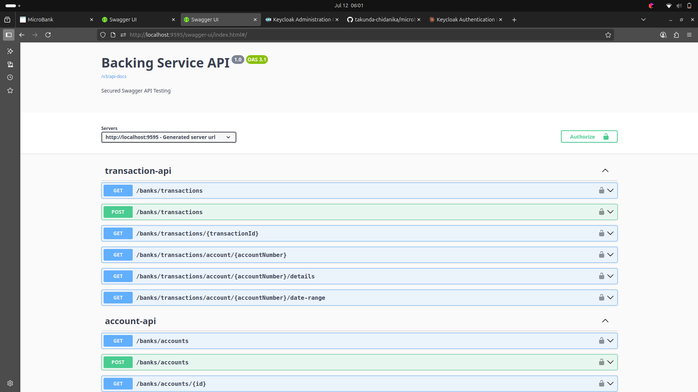
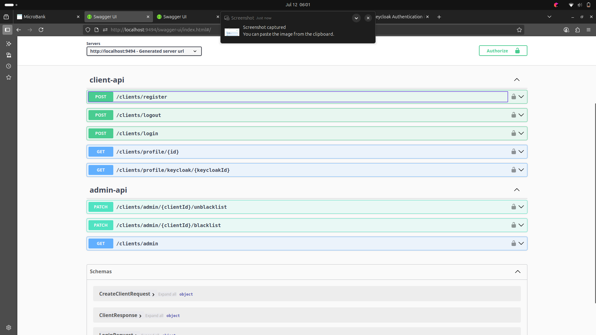

# MicroBank Backend API Documentation

##  Banking Service

*Banking service successfully running with Keycloak integration*

##  Client Service

*Client service with user registration and authentication*

## Overview
Enterprise-grade microservices banking platform with Spring Boot, Keycloak authentication, and comprehensive API coverage. All services are production-ready with OpenAPI 3.1 documentation and security implementations.

## Architecture
- **Gateway Service**: Spring Cloud Gateway (Port 9393)
- **Client Service**: User management & authentication (Port 9494)
- **Banking Service**: Accounts & transactions (Port 9495)
- **Discovery Service**: Eureka service registry (Port 8761)
- **Authentication**: Keycloak OAuth2/JWT (Port 8080)

## Base URLs
- **Gateway**: `http://localhost:9393`
- **Client Service Direct**: `http://localhost:9494`
- **Banking Service Direct**: `http://localhost:9495`

## Authentication
All APIs secured with Keycloak JWT tokens.
- **Realm**: microbank
- **Client ID**: microbank
- **Auth Flow**: Authorization Code + PKCE

## API Endpoints

### Client Management API

#### Public Endpoints

**POST /clients/register**
```json
Request:
{
  "name": "string",
  "email": "string", 
  "password": "string"
}

Response (201):
{
  "id": "string",
  "name": "string",
  "email": "string",
  "keycloakId": "string",
  "createAt": "2025-07-12T06:09:00Z",
  "isBlacklisted": false
}
```

**POST /clients/login**
```json
Request:
{
  "email": "string",
  "password": "string"
}

Response (200):
{
  "access_token": "string",
  "expires_in": 300,
  "refresh_expires_in": 1800,
  "token_type": "Bearer",
  "refresh_token": "string"
}
```

**POST /clients/logout**
```
Response (200):
{
  "message": "Logout successful"
}
```

#### Protected Endpoints

**GET /clients/profile/{id}** [Protected]
```json
Response (200):
{
  "id": "string",
  "name": "string", 
  "email": "string",
  "keycloakId": "string",
  "createAt": "2025-07-12T06:09:00Z",
  "isBlacklisted": false
}
```

**GET /clients/profile/keycloak/{keycloakId}** 🔒
```json
Response (200):
{
  "id": "string",
  "name": "string",
  "email": "string", 
  "keycloakId": "string",
  "createAt": "2025-07-12T06:09:00Z",
  "isBlacklisted": false
}
```

### Admin Management API

All admin endpoints require `ADMIN` role.

**PATCH /clients/admin/{clientId}/blacklist** 🔒 ADMIN
```json
Response (200):
{
  "id": "string",
  "name": "string",
  "email": "string",
  "keycloakId": "string", 
  "createAt": "2025-07-12T06:09:00Z",
  "isBlacklisted": true
}
```

**PATCH /clients/admin/{clientId}/unblacklist** 🔒 ADMIN
```json
Response (200):
{
  "id": "string",
  "name": "string",
  "email": "string",
  "keycloakId": "string",
  "createAt": "2025-07-12T06:09:00Z", 
  "isBlacklisted": false
}
```

**GET /clients/admin** 🔒 ADMIN
```json
Response (200):
[
  {
    "id": "string",
    "name": "string",
    "email": "string",
    "keycloakId": "string",
    "createAt": "2025-07-12T06:09:00Z",
    "isBlacklisted": false
  }
]
```

### Banking Service API

#### Account Management

**POST /banks/accounts** 🔒
```json
Request:
{
  "clientId": "string",
  "initialBalance": "1000.00",
  "authorisationCode": "string"
}

Response (200):
{
  "id": "string",
  "accountNumber": "string",
  "balance": "1000.00",
  "clientId": "string",
  "createAt": "2025-07-12T06:09:00Z"
}
```

**GET /banks/accounts/client/{clientId}** 🔒
```json
Response (200):
{
  "id": "string",
  "accountNumber": "string", 
  "balance": "1000.00",
  "clientId": "string",
  "createAt": "2025-07-12T06:09:00Z"
}
```

**GET /banks/accounts/{id}** 🔒
```json
Response (200):
{
  "id": "string",
  "accountNumber": "string",
  "balance": "1000.00", 
  "clientId": "string",
  "createAt": "2025-07-12T06:09:00Z"
}
```

**GET /banks/accounts/number/{accountNumber}** 🔒
```json
Response (200):
{
  "id": "string",
  "accountNumber": "string",
  "balance": "1000.00",
  "clientId": "string",
  "createAt": "2025-07-12T06:09:00Z"
}
```

**GET /banks/accounts** 🔒
```json
Response (200):
[
  {
    "id": "string",
    "accountNumber": "string",
    "balance": "1000.00",
    "clientId": "string", 
    "createAt": "2025-07-12T06:09:00Z"
  }
]
```

**GET /banks/accounts/balance/{accountNumber}** 🔒
```json
Response (200): "1000.00"
```

#### Transaction Management

**POST /banks/transactions** 🔒
```json
Request:
{
  "accountNumber": "string",
  "amount": "100.00",
  "type": "DEPOSIT" // DEPOSIT, WITHDRAWAL, TRANSFER
}

Response (200):
{
  "id": "string",
  "amount": "100.00",
  "type": "DEPOSIT",
  "accountNumber": "string",
  "createAt": "2025-07-12T06:09:00Z"
}
```

**GET /banks/transactions** 🔒
```json
Response (200):
[
  {
    "id": "string",
    "amount": "100.00",
    "type": "DEPOSIT",
    "accountNumber": "string",
    "createAt": "2025-07-12T06:09:00Z"
  }
]
```

**GET /banks/transactions/account/{accountNumber}** 🔒
```json
Response (200):
[
  {
    "id": "string",
    "amount": "100.00",
    "type": "DEPOSIT",
    "accountNumber": "string",
    "createAt": "2025-07-12T06:09:00Z"
  }
]
```

**GET /banks/transactions/account/client/{clientId}** 🔒
```json
Response (200):
[
  {
    "id": "string", 
    "amount": "100.00",
    "type": "DEPOSIT",
    "accountNumber": "string",
    "createAt": "2025-07-12T06:09:00Z"
  }
]
```

**GET /banks/transactions/account/{accountNumber}/details** 🔒
```json
Response (200):
{
  "account": {
    "id": "string",
    "accountNumber": "string",
    "balance": "1000.00",
    "clientId": "string",
    "createAt": "2025-07-12T06:09:00Z"
  },
  "transactions": [
    {
      "id": "string",
      "amount": "100.00",
      "type": "DEPOSIT",
      "accountNumber": "string",
      "createAt": "2025-07-12T06:09:00Z"
    }
  ]
}
```

**GET /banks/transactions/{transactionId}** 🔒
```json
Response (200):
{
  "id": "string",
  "amount": "100.00",
  "type": "DEPOSIT",
  "accountNumber": "string",
  "createAt": "2025-07-12T06:09:00Z"
}
```

**GET /banks/transactions/account/{accountNumber}/date-range** 🔒
```
Query Parameters:
- startDate: 2025-07-01 (ISO date)
- endDate: 2025-07-12 (ISO date)

Response (200):
[
  {
    "id": "string",
    "amount": "100.00", 
    "type": "DEPOSIT",
    "accountNumber": "string",
    "createAt": "2025-07-12T06:09:00Z"
  }
]
```

## Data Models

### TransactionType Enum
- `DEPOSIT`
- `WITHDRAWAL`
- `TRANSFER`

## Security Features
- JWT-based authentication via Keycloak
- Role-based access control (RBAC)
- Blacklist functionality for client management
- CORS configuration
- Request/response logging
- Global exception handling

## Error Handling
- **400**: Bad Request - Invalid input data
- **401**: Unauthorized - Missing/invalid token
- **403**: Forbidden - Insufficient permissions
- **404**: Not Found - Resource not found
- **409**: Conflict - Resource already exists
- **500**: Internal Server Error

## Swagger UI
- **Client Service**: http://localhost:9494/swagger-ui/index.html
- **Banking Service**: http://localhost:9495/swagger-ui/index.html
- **Gateway**: http://localhost:9393/swagger-ui/index.html

## Database Schema
- **PostgreSQL databases**: client_db, banking_db
- **Auto-DDL**: Enabled for development
- **Connection pooling**: HikariCP

## Service Discovery
All services register with Eureka at http://localhost:8761

## Build & Deployment
```bash
# Build all services
mvn clean install

# Start infrastructure
docker-compose up

# Individual service ports
Gateway: 9393
Client: 9494  
Banking: 9495
Discovery: 8761
Keycloak: 8080
```
